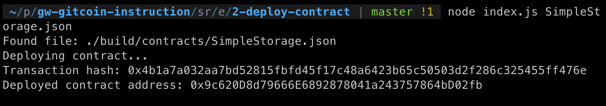

# Task 2: Deploy A Simple Ethereum Smart Contract On Polyjuice
https://gitcoin.co/issue/nervosnetwork/grants/3/

1) A screenshot of the console output immediately after you have successfully deployed a smart contract:

2) The transaction hash from the contract deployment (in text format):
```
0x4b1a7a032aa7bd52815fbfd45f17c48a6423b65c50503d2f286c325455ff476e
```
3) The deployed contract address from the contract deployment (in text format):
```
0x9c620D8d79666E6892878041a243757864bD02fb
```
