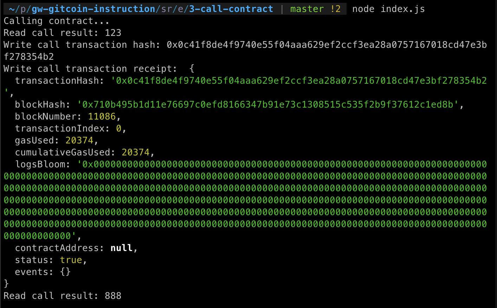

# Task 3: Issue A Smart Contract Call To The Deployed Smart Contract
https://gitcoin.co/issue/nervosnetwork/grants/4/

1) A screenshot of the console output immediately after you have successfully issued a smart contract call:

2) The transaction hash from the contract deployment (in text format):
```
0x0c41f8de4f9740e55f04aaa629ef2ccf3ea28a0757167018cd47e3bf278354b2
```
3) The contract address that you called (in text format):
```
0x9c620D8d79666E6892878041a243757864bD02fb
```
4) The ABI for contract you made a call on (in text format):

```
[
       {
      "inputs": [],
      "stateMutability": "payable",
      "type": "constructor"
    },
    {
      "inputs": [
        {
          "internalType": "uint256",
          "name": "x",
          "type": "uint256"
        }
      ],
      "name": "set",
      "outputs": [],
      "stateMutability": "payable",
      "type": "function"
    },
    {
      "inputs": [],
      "name": "get",
      "outputs": [
        {
          "internalType": "uint256",
          "name": "",
          "type": "uint256"
        }
      ],
      "stateMutability": "view",
      "type": "function"
    }
]
```