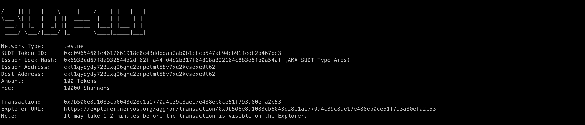
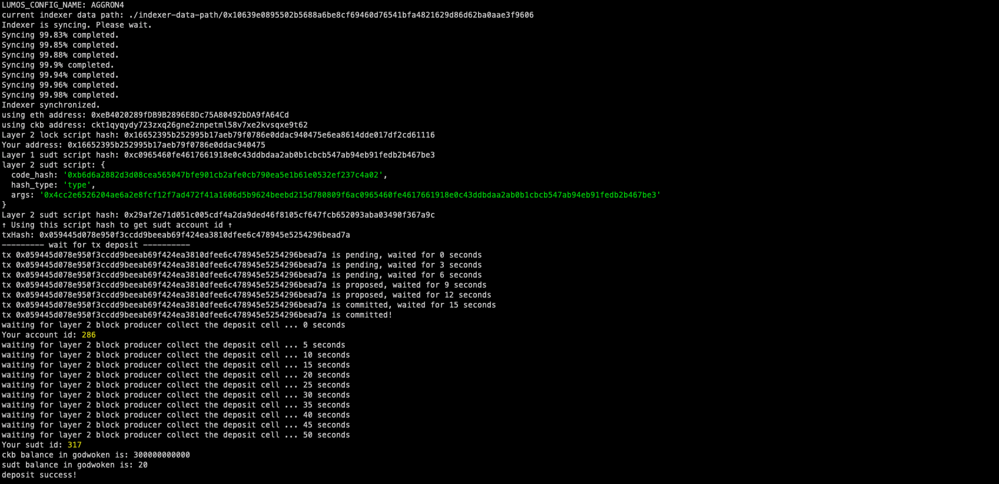

# Task 4: Issue An SUDT Token On Layer 1 And Deposit It To Layer 2
https://gitcoin.co/issue/nervosnetwork/grants/5/

1) A link to the Layer 1 address you funded on the Testnet Explorer.
https://explorer.nervos.org/aggron/address/ckt1qyqydy723zxq26gne2znpetml58v7xe2kvsqxe9t62
2) A screenshot of the console output immediately after using sudt-cli to create your SUDT tokens on Layer 1.

3) A link to the transaction ID created by sudt-cli on the Testnet Explorer.
https://explorer.nervos.org/aggron/transaction/0x9b506e8a1083cb6043d28e1a1770a4c39c8ae17e488eb0ce51f793a80efa2c53
4) A screenshot of the console output immediately after you have successfully submitted a deposit to Layer 2 using the account-cli tool.


5) The SUDT ID from the console output after executing the deposit script (in text format)
```
317
```