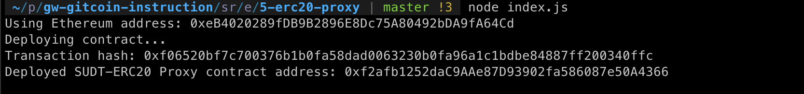
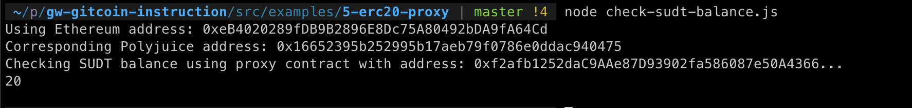

# Task 5: Deploy The ERC20 Proxy Contract For The Deposited SUDT
https://gitcoin.co/issue/nervosnetwork/grants/6/

1) A screenshot of the console output immediately after deploying smart contract.

2) The address of the ERC20 Proxy Contract you deployed (in text format).
```
0xf2afb1252daC9AAe87D93902fa586087e50A4366
```
3) A screenshot of the console output immediately after checking your SUDT balance.

4) The Ethereum address that was checked (in text format).
```
0xeB4020289fDB9B2896E8Dc75A80492bDA9fA64Cd
```