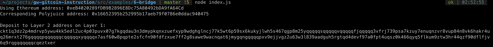

# Task 6: Use Force Bridge To Deposit Tokens From Ethereum To Polyjuice
https://gitcoin.co/issue/nervosnetwork/grants/7/

1) A screenshot of the console output immediately after you have successfully generated your Deposit Receiver Address.

2) Your Deposit Receiver Address (in text format).
```
ckt1q3dz2p4mdrvp5ywu4kk5edl2uc4p03puvx07g7kgqdau3n3dmypkqnxzuefxyp9wdghglncj77k5wt6p59sx6kukyjlwh5s467qgp8m25yqqqqqsqqqqqvqqqqqfjqqqqq3vfrj739psa7kzuy7enuqnzvr8vup84n8vk6hakr4uq26mrxt276gqqqqpqqqqqqcqqqqqxyqqqqx7asf60w8pqpte2sfcfn90fdfzxue7ff2g8sawe9wacnqat6jmygqngqqqqpxv9ejjvgz2u63w3l839aadguh5rgtqd4devf97a0fpt4uqsz0k466qyq5flkum9ztw3hr44qzf90dflfjv6q9rqgqqqqqqcqeztxer
```
3) The Ethereum address used to generate the Deposit Receiver Address (in text format).
```
0xeB4020289fDB9B2896E8Dc75A80492bDA9fA64Cd
```
4) A link to the Etherscan explorer for the successful Force Bridge transaction. This can be found on Force Bridge under History→Succeed.
https://rinkeby.etherscan.io/tx/0x3a7be11a1c89300bcc37a799f9d6117e8e8cde6f61140bed4fdb116ca92a0e95
5) A link to the Nervos explorer for the successful Force bridge transaction. This can be found on Force Bridge under History→Succeed.
https://explorer.nervos.org/aggron/transaction/0x684118da2ad8be26e6cbd0baee475f5e4c8dbda2873c53e048a50cd50109d857