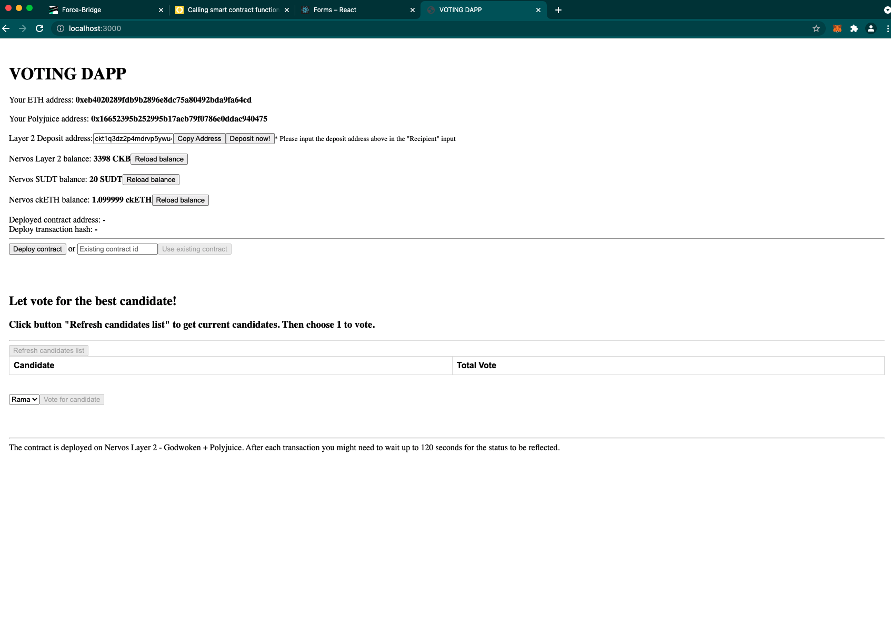

# Task 8: Modify The Ported DApp So It Supports Ethereum Assets Via Force Bridge
https://gitcoin.co/issue/nervosnetwork/grants/9/

1) A screenshot or video of your EVM application on Layer 2 with Force Bridge support.
https://youtu.be/abkX12kiBlc


2) The address of the SUDT-ERC20 Proxy Contract that you deployed (in text format).
```
0xf2afb1252daC9AAe87D93902fa586087e50A4366
```
3) A link to the GitHub repository with your EVM application that integrates Force Bridge support.
https://github.com/phungnm/polyjuice-ported-voting-dapp