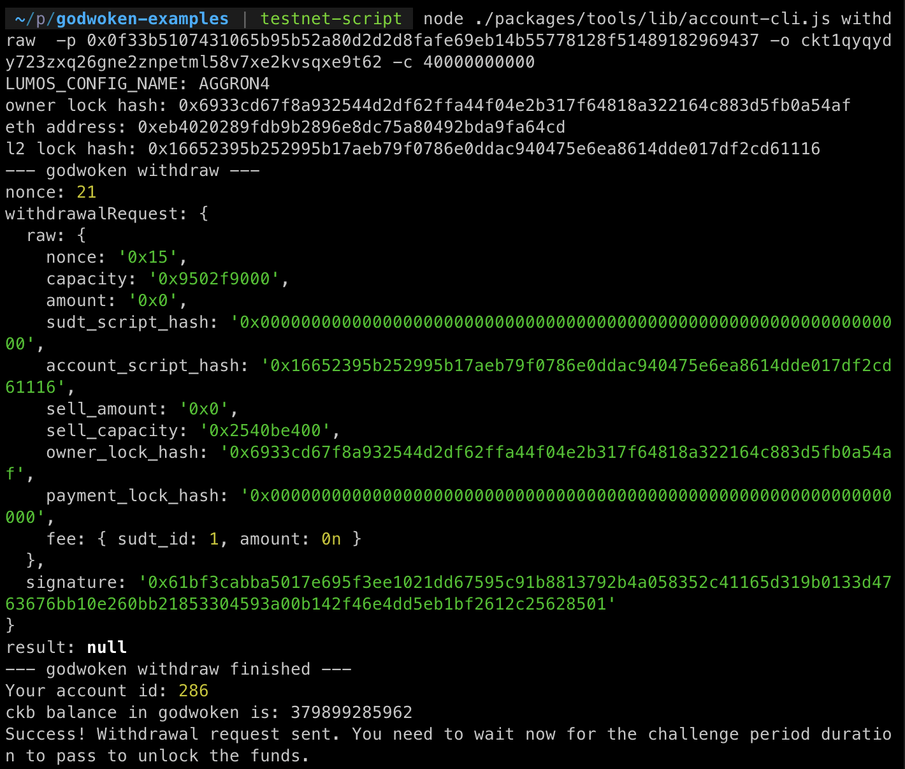

# Task 9:  Initiate Withdrawal Process From The Layer 2 Back To Layer 1
https://gitcoin.co/issue/nervosnetwork/grants/10/

1) A screenshot of the console output immediately after running the withdraw command.

2) The Ethereum address that you've used for your Layer 2 account (in text format).
```
0xeB4020289fDB9B2896E8Dc75A80492bDA9fA64Cd
```
3) The Nervos Layer 1 address that you passed to withdraw command (in text format).
```
ckt1qyqydy723zxq26gne2znpetml58v7xe2kvsqxe9t62
```